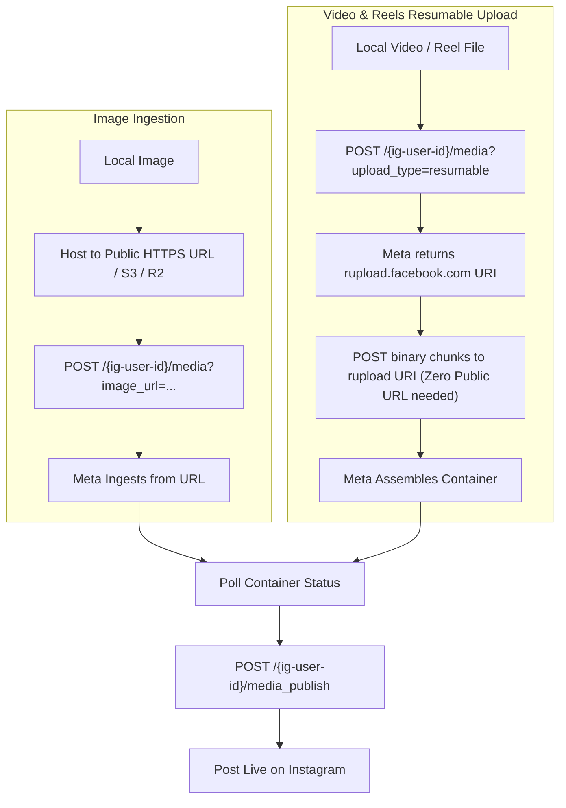

# Instagram Media Upload & Hosting Specifications (Meta Graph API v21.0)

> [!IMPORTANT]
> **API Version:** Meta Graph API `v21.0` / `v22.0`  
> **Target Accounts:** Instagram Professional (Business / Creator) accounts only.

This document outlines the official Meta requirements, file specifications, and upload workflows for publishing single images, videos, Reels, and multi-item carousel posts.

---

## 1. Media Format & Technical Specifications

### A. Single Images
Meta Graph API processes single images via direct HTTPS URL ingestion.

| Property | Requirement | Recommended |
| :--- | :--- | :--- |
| **File Format** | JPEG (`image/jpeg`) strictly | JPEG, 24-bit sRGB color profile |
| **Max File Size** | 8 MB | < 5 MB |
| **Aspect Ratio Range** | `4:5` (0.80) to `1.91:1` (1.91) | `1:1` (Square) or `4:5` (Vertical Portrait) |
| **Minimum Dimensions** | 320 x 320 px | 1080 x 1080 px (`1:1`) or 1080 x 1350 px (`4:5`) |
| **Maximum Dimensions** | 1440 x 1800 px (scaled down if larger) | 1080 x 1350 px |

### B. Feed Videos
| Property | Requirement | Recommended |
| :--- | :--- | :--- |
| **Container** | MP4 or MOV | MP4 (`video/mp4`) |
| **Video Codec** | H.264 (AVC), Progressive scan | H.264 High Profile, Closed GOP |
| **Audio Codec** | AAC, 128 kbps+, 48 kHz sample rate | Stereo AAC, 48 kHz |
| **Duration** | 3 seconds to 60 seconds (feed) | 15–30 seconds |
| **Aspect Ratio** | `4:5` to `16:9` | `4:5` (1080 x 1350 px) or `1:1` (1080 x 1080 px) |
| **Max File Size** | 100 MB (via URL) / 1 GB (via Resumable) | < 100 MB |
| **Frame Rate** | 23 to 60 FPS | 30 FPS |

### C. Instagram Reels
| Property | Requirement | Recommended |
| :--- | :--- | :--- |
| **Container** | MP4 or MOV | MP4 |
| **Video Codec** | H.264 (AVC) | H.264, baseline or high profile |
| **Audio Codec** | AAC | Stereo AAC, 48 kHz |
| **Duration** | 3 seconds to 90 seconds (standard Reels API) | 15–60 seconds |
| **Aspect Ratio** | Strictly `9:16` (0.5625) | `9:16` (1080 x 1920 px) |
| **Max File Size** | 1 GB | < 250 MB |
| **Frame Rate** | 24 to 60 FPS | 30 or 60 FPS |

### D. Carousel Posts (Multi-Item)
- **Item Count:** 2 to 10 items per carousel.
- **Allowed Types:** Any combination of images and videos.
- **Aspect Ratio Consistency:** All items in a single carousel **must share the same aspect ratio** as the first item. If the first item is `1:1`, all subsequent items will be cropped to `1:1`.

---

## 2. Ingestion & Upload Architectures

Meta Graph API provides two distinct mechanisms for delivering media to Instagram containers:



### A. Video & Reels: Resumable Binary Upload (Zero Public URL)
For video files and Reels, Meta supports the **resumable upload protocol**. This eliminates the need to expose a public internet URL for large video files.

#### Step 1: Initialize Resumable Upload Session
```http
POST https://graph.facebook.com/v21.0/{ig-user-id}/media
Content-Type: application/x-www-form-urlencoded

media_type=REELS
&upload_type=resumable
&caption=Exciting+new+update!
&access_token={access_token}
```
**Meta Response:**
```json
{
  "id": "17998877665544332",
  "uri": "https://rupload.facebook.com/ig-video-upload/v21.0/17998877665544332"
}
```

#### Step 2: Stream Raw Binary to the Upload URI
Stream the file contents in one or more chunks directly to the upload endpoint:
```http
POST https://rupload.facebook.com/ig-video-upload/v21.0/17998877665544332
Authorization: OAuth {access_token}
offset: 0
file_size: {total_bytes}
Content-Type: application/octet-stream

<binary video stream>
```
**Meta Response:**
```json
{
  "success": true
}
```

#### Step 3: Poll Processing Status
```http
GET https://graph.facebook.com/v21.0/17998877665544332?fields=status_code,status&access_token={access_token}
```
Possible values for `status_code`:
- `IN_PROGRESS`: Video is still transcoding or processing. Wait and poll again with exponential backoff (e.g., 5s, 10s, 20s).
- `FINISHED`: Container is fully ready for publication.
- `ERROR`: Video processing failed. Check `status` or error subcode.
- `EXPIRED`: Container was not published within 24 hours of creation.

#### Step 4: Publish Container
```http
POST https://graph.facebook.com/v21.0/{ig-user-id}/media_publish
Content-Type: application/x-www-form-urlencoded

creation_id=17998877665544332
&access_token={access_token}
```
**Meta Response:**
```json
{
  "id": "17891234567890123"
}
```

---

### B. Single Images: Public HTTPS URL Requirement & Local Strategies
Unlike videos, Meta Graph API v21.0 **does not support resumable binary uploads for single image posts**. The API requires an `image_url` parameter pointing to a publicly accessible HTTPS endpoint.

#### Hosting Strategies for Self-Hosted Deployments

1. **Cloud Object Storage with Presigned URLs (Recommended for Production):**
   - Upload image to Amazon S3, Cloudflare R2, Google Cloud Storage, or Backblaze B2.
   - Generate a short-lived presigned HTTPS URL (e.g., 15-minute expiration).
   - Supply the presigned URL to `image_url`. Meta fetches the image immediately during container creation, after which the URL can safely expire.

2. **Edge Gateway Proxy (Full Mode):**
   - The self-hosted `gateway` service serves a temporary authenticated endpoint:
     `https://your-domain.example.com/media/temp/{uuid}.jpg`
   - Serves the file only while Meta fetches it, then purges the cache.

3. **Cloudflare Tunnel / ngrok (Local Development):**
   - Expose local storage temporarily to an HTTPS endpoint via Cloudflare Tunnel (`cloudflared tunnel`) or `ngrok` for testing.

---

## 3. Carousel Publishing Protocol

To publish a carousel post (2–10 items):

1. **Create Item Containers:**
   For each item (image or video), issue a container creation request with `is_carousel_item=true`:
   ```http
   POST /{ig-user-id}/media?image_url={url_1}&is_carousel_item=true
   POST /{ig-user-id}/media?image_url={url_2}&is_carousel_item=true
   ```
   Collect child container IDs: `[child_id_1, child_id_2, ...]`.

2. **Wait for Child Containers:**
   Poll status on each child container until all return `FINISHED`.

3. **Create Parent Carousel Container:**
   ```http
   POST /{ig-user-id}/media
   Content-Type: application/x-www-form-urlencoded

   media_type=CAROUSEL
   &children={child_id_1},{child_id_2}
   &caption=My+first+carousel!
   ```
   Returns parent container ID: `parent_container_id`.

4. **Publish Parent Container:**
   ```http
   POST /{ig-user-id}/media_publish?creation_id={parent_container_id}
   ```

---

## 4. Scheduling Workflow

Meta Graph API does not support native internal server scheduling. In `mcb-server-instagram`:
1. The AI client requests scheduling via `schedule_post`.
2. The job is placed into PostgreSQL `publish_queue` with status `scheduled` and `next_run_at = scheduled_at`.
3. The Go `core-worker` polls `publish_queue` via `SELECT ... FOR UPDATE SKIP LOCKED` where `next_run_at <= NOW()`.
4. When the scheduled timestamp arrives, the worker claims the job and executes the container creation -> polling -> publish lifecycle automatically.
