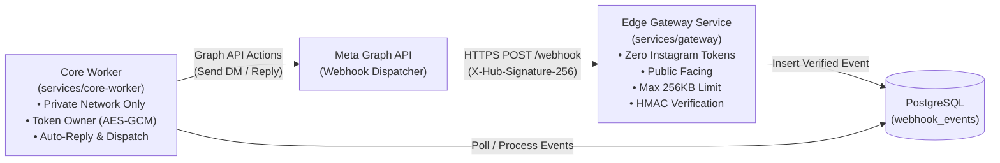
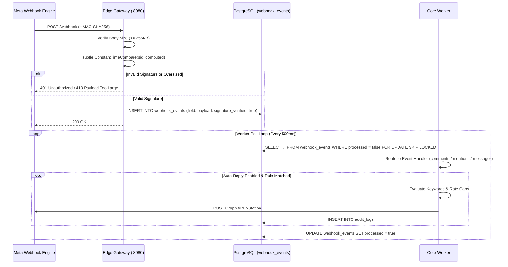

# Instagram Webhooks Architecture & Tunneling Guide

This document details how Meta Instagram Webhooks are received, verified, isolated, and processed within **MCB Server Instagram**, including local development tunneling, production deployment, and security boundaries.

---

## 1. Webhook Architecture Overview

Meta Graph API dispatches realtime webhook notifications whenever new activity occurs on your Instagram Professional account (e.g., incoming direct messages, post comments, or account mentions).

To protect access tokens and internal services, MCB Server Instagram uses a **split-privilege edge architecture**:



### Zero-Token Security Isolation Model
1. **No Token Exposure at Edge**: The internet-facing `gateway` service has **ZERO** Instagram Access Tokens in its environment, memory, or storage.
2. **Secrets Required by Gateway**:
   - `META_APP_SECRET`: Used solely to compute HMAC-SHA256 digest and verify `X-Hub-Signature-256`.
   - `META_WEBHOOK_VERIFY_TOKEN`: Arbitrary shared secret string used to respond to the initial `hub.challenge` during setup.
3. **Defense in Depth**: Even if the edge gateway were completely compromised, an attacker gains **no access** to your Instagram account, cannot forge API requests, and cannot read account data.
4. **Internal Worker Isolation**: Only the private `core-worker` (running inside a private VPC or local network with no ingress ports) has access to decrypt access tokens and perform Graph API mutations.

---

## 2. Ingress & Tunneling Requirements

Meta requires an accessible, public **HTTPS** endpoint with a valid SSL/TLS certificate. Self-signed certificates are rejected by Meta.

For local development or self-hosted servers without a static public IP, choose one of the following tunneling solutions:

### Option A: Cloudflare Tunnel (Recommended)
Cloudflare Tunnels (`cloudflared`) provide secure, stable HTTPS ingress without opening firewall ports or port forwarding:
```bash
# 1. Install cloudflared (or run via Docker)
# 2. Run tunnel pointing to local gateway port (default :8080)
cloudflared tunnel --url http://localhost:8080
```
`cloudflared` outputs an assigned HTTPS URL such as `https://your-tunnel-name.trycloudflare.com`.
Your Webhook Callback URL will be:
`https://your-tunnel-name.trycloudflare.com/webhook`

### Option B: ngrok
```bash
ngrok http 8080
```
Note the forwarding URL (e.g., `https://abc123.ngrok-free.app`).
Your Webhook Callback URL will be:
`https://abc123.ngrok-free.app/webhook`

### Option C: Production Reverse Proxy (Caddy / Nginx)
In production, point your DNS (e.g., `webhooks.yourdomain.com`) to your server running Caddy or Nginx with Let's Encrypt SSL, proxy-passing to the internal `gateway:8080`.

---

## 3. Webhook Protocol & Verification

### Step 1: Verification Handshake (`GET /webhook`)
When you register or update the Callback URL in the Meta App Dashboard, Meta sends a `GET` request:
```http
GET /webhook?hub.mode=subscribe&hub.challenge=1158201444&hub.verify_token=YOUR_VERIFY_TOKEN HTTP/1.1
Host: your-tunnel.example.com
```

The gateway verifies:
1. `hub.mode` equals `subscribe`.
2. `hub.verify_token` matches your configured `META_WEBHOOK_VERIFY_TOKEN`.

If valid, the gateway immediately returns HTTP `200 OK` with the exact `hub.challenge` string in the body. If invalid, it returns HTTP `403 Forbidden`.

### Step 2: Event Notification & Signature Verification (`POST /webhook`)
When an event occurs, Meta sends a `POST` request with:
- Header `X-Hub-Signature-256`: `sha256=<hex_hmac>`
- Header `Content-Type`: `application/json`
- Body: JSON payload containing entries and changes.

The gateway executes strict verification:
1. **Body Size Cap**: Strictly enforces max 256 KB. Payloads exceeding this limit are aborted immediately with HTTP `413 Payload Too Large`.
2. **HMAC Signature Check**: Computes HMAC-SHA256 of the raw request body using `META_APP_SECRET` as the secret key.
3. **Constant-Time Comparison**: Compares the received signature against the computed signature using `crypto/subtle.ConstantTimeCompare` to avoid timing attacks.
4. **Immediate Storage**: If valid, stores the payload in `webhook_events` with `signature_verified = true` and `processed = false`, then responds with HTTP `200 OK` within Meta's 5-second timeout window.

---

## 4. Subscribing to Instagram Webhook Fields

In the [Meta App Dashboard](https://developers.facebook.com/apps/):
1. Navigate to **Instagram Platform** -> **API Setup with Instagram Login** (or **Webhooks**).
2. Set **Callback URL** to `https://<your-domain-or-tunnel>/webhook`.
3. Set **Verify Token** to the exact string matching `META_WEBHOOK_VERIFY_TOKEN` in your `.env`.
4. Click **Verify and Save**.
5. Subscribe to the following fields:
   - `comments`: Captures comments and replies on your media.
   - `mentions`: Captures caption and comment mentions of your username.
   - `messages`: Captures incoming Instagram Direct Messages (requires `instagram_manage_messages` permission).
   - `messaging_postbacks`: Captures user button clicks in direct conversations.

---

## 5. Webhook Event Processing Lifecycle


